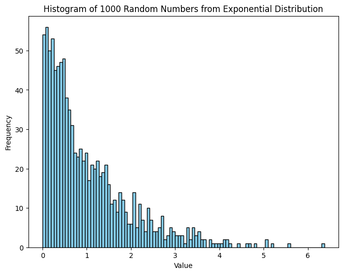

```python
import matplotlib.pyplot as plt
import numpy as np
```


```python
scale = 1.0
r_numbers = np.random.exponential(scale, 1000) 
```


```python
plt.figure(figsize=(8,6))
plt.hist(r_numbers, bins=100, color='skyblue', edgecolor='black')
plt.xlabel('Value')
plt.ylabel('Frequency')
plt.title('Histogram of 1000 Random Numbers from Exponential Distribution')
plt.show()
```


    

    

