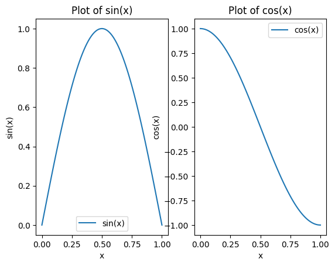

```python
import matplotlib.pyplot as plt
import numpy as np 
```


```python
x = np.linspace(0, 1, 100)
```


```python
def sin_x(x):
    return np.sin(x * np.pi)
```


```python
def cos_x(x):
    return np.cos(x * np.pi)
```


```python
plt.figure(figsize=(10,5))
```


    <Figure size 1000x500 with 0 Axes>


    <Figure size 1000x500 with 0 Axes>


```python
plt.subplot(1, 2, 1)
plt.plot(x, sin_x(x), label ='sin(x)')
plt.xlabel('x')
plt.ylabel('sin(x)')
plt.title('Plot of sin(x)')
plt.legend()
plt.subplot(1, 2, 2)
plt.plot(x, cos_x(x), label ='cos(x)')
plt.xlabel('x')
plt.ylabel('cos(x)')
plt.title('Plot of cos(x)')
plt.legend()
```


    <matplotlib.legend.Legend at 0x119967ecc50>


    

    

