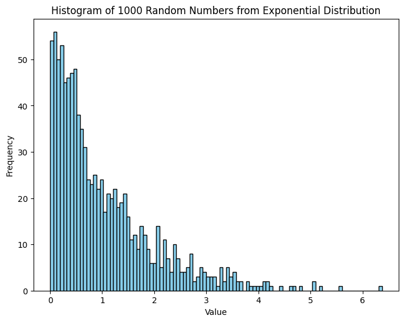

```python
import matplotlib.pyplot as plt
import numpy as np 
```


```python
r_numbers = np.random.uniform(0, 1, 1000)
```


```python
plt.figure(figsize=(8,6))
plt.hist(r_numbers, bins=100, color='skyblue', edgecolor='black')
plt.xlabel('Value')
plt.ylabel('Frequency')
plt.title('Histogram of 100 Random numbers')
plt.savefig('random_numbers_histogram.pdf')
plt.show()
```


    

    

